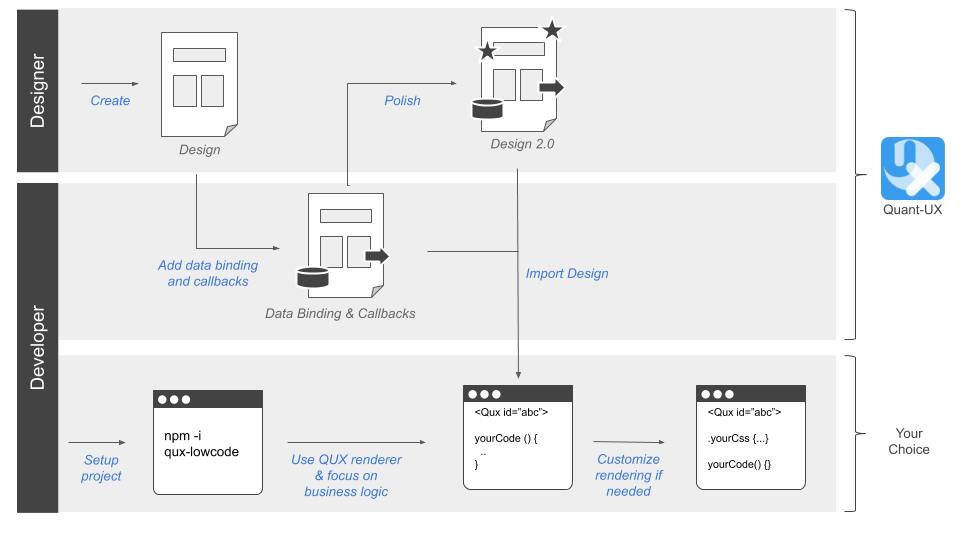

# qux-low-code
Quant-UX is an OpenSource low code environment that enables the visual development of VUE.js based user interfaces. Quant-UX enables:

1. Clear seperation of UI and business logic
2. Developers do not have to worry about the design and animations
3. Designers can use powerfull visual design tool
3. Easy extension with custom callback functions
4. Full support of VUE data binding.
5. Extension with custom components
6. Rich library of stylable components.

## The problem
Designer and developers use different tools that do not allow a clean handoff between the two worlds. As a result, a UI design has to be completely implemented from scratch. Quant-UX addresses this issue by allowing the direct inclusion of the design artefacts into a VUE application without restricting the developers freedom. The rendering of the visual design is done by a dedicated component (QUX), that supports responsive rendering, data- and method-binding and offers a rich set of extension points to embed custom code into the designs. 

## Envisioned workflow




# How to use qux-lowcode

First, you have to install the QUX-LowCode  package via NPM
```
npm i qux-lowcode
```

Second, you have to globaly import the QUX component

```
import Vue from "vue";
import QUX from 'qux-lowcode'
Vue.use(QUX);
```

## Place the QUX component.

Now you can start including the component, for instance in your home components. You have to pass your Quant-UX prototype
to the component, so it knows what to render. You can either pass a **javascrit object** or a **share key**

```
<QUX :app="app"/>
```

```
<QUX :debug="sharekey"/>
```

You can optain the share key from the http://quant-ux.com website by clicking share in the canvas menu. In general the share key is best for development. Updates in Quant-UX will be immediatly visible after a page reload. However, for production you should pass an app
object. You can download the app json with the following command:

```
tbd
```

Please note that home component should be wrapped by a router-view, otherwise navigation will not work. If you use VUE-CLI to bootrap the project, everything will be configured out of the box.

```
 <div id="app">
    <router-view/>
  </div>
```

## Update Router

Last, you have to update your router to delegate all routes to home. 

```
const routes = [
  {
    path: '/',
    name: 'home',
    component: () => import(/* webpackChunkName: "about" */ '../views/Home.vue')
  },
  {
    path: '/:screenName.html',
    name: 'qux',
    component: () => import(/* webpackChunkName: "about" */ '../views/Home.vue')
  }
]
```

The default paramter QUX will look for is 'screenName'. 

## Configure qux-lowcode

You can configure certain parameters, e.g. the routing rules. To do so, pass a config object to the 
qux component.

```
<QUX :app="app":config="config"/>
```

The config object can have the following properties and hsould be defined in the data section of the home component.

```
    config: {
        css: {
          grid: true, // Use CSS grid to align objects. False will use CSS-Flex.
          justifyContentInWrapper: true // In justifz or left align content in wrapped elements
        },
        router: {
          key: 'id', // alternative routing parameter
          prefix: 'qux' // path prefix that will be used when rendering links
        }
    }
```


## Data Binding

QUX-LowCode supports VUE data binding. You have to pass a v-model to the QUX component. The databindings for the
widgets must be defined in the Quant-UX canvas.

```
<QUX :app="app" v-model="payloud"/>
```

## Method Binding

In the Quant-UX canvas you can define javascript callbacks for the widgets. Place the methods in the parent compoent of QUX. The method will have the following signature:

```
myMethod (value, element, e) {
 ...
}
```

## Examples
https://github.com/KlausSchaefers/qux-low-code-example


# Dev Setup

```
npm install
```

```
npx bili --bundle-node-modules
```